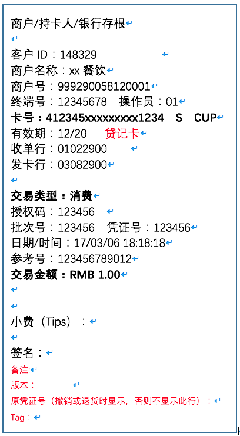
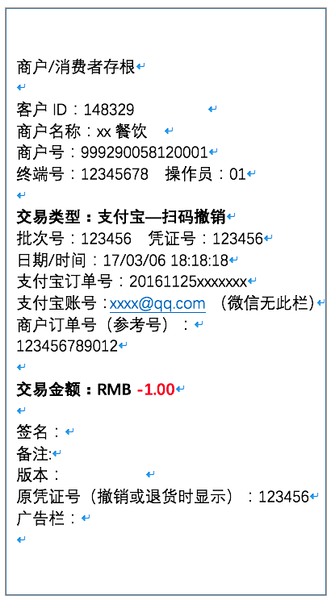

### 交易应答码表V3(20160811更新)

|代码|POS显示(计划实施)
|:--|:--|
00|交易成功
01|"01-交易失败请联系发卡行"
02|"02-交易失败请联系发卡行"
03|"03-无效商户请联系客服"
04|"04-卡片异常请换卡重试"
05|"05-交易失败请联系发卡行"
06|"06-交易失败请联系发卡行"
07|"07-卡片异常请换卡重试"
09|"09-交易失败请重试"
12|"12-发卡行不支持的交易"
13|"13-无效金额"
14|"14-无效卡号请联系发卡行或换卡重试"
15|"15-无此发卡行请换卡重试"
19|"19-交易失败请重试"
20|"20-交易失败请联系发卡行"
21|"21-交易失败请联系发卡行"
22|"22-操作有误请重试"
23|"23-交易失败请联系发卡行"
25|"25-未找到原交易请重试或联系客服"
30|"30-格式错误请联系客服"
31|"31-交易失败请联系客服"
33|"33-过期卡请换卡重试"
34|"34-卡片异常请联系发卡行"
35|"35-卡片异常请联系发卡行"
36|"36-卡片异常请联系发卡行"
37|"37-卡片异常请联系发卡行"
38|"38-密码错误次数超限"
39|"39-交易失败请换卡重试"
40|"40-不支持的交易类型请联系客服"
41|"41-卡片异常请联系发卡行"
42|"42-卡片异常请联系发卡行"
43|"43-卡片异常请联系发卡行"
44|"44-交易失败请联系发卡行"
45|"45-请插卡交易或联系客服"
51|"51-余额不足"
52|"52-交易失败请换卡重试"
53|"53-交易失败请换卡重试"
54|"54-过期卡请换卡重试"
55|"55-密码错误请重试"
56|"56-交易失败请换卡重试"
57|"57-卡片异常请联系客服或换卡重试"
58|"58-未授权的交易请联系客服"
59|"59-卡片异常请联系发卡行"
60|"60-卡片异常请联系发卡行"
61|"61-超出金额限制请联系客服或换卡重试"
62|"62-卡片异常请联系发卡行"
63|"63-交易失败请联系发卡行"
64|"64-交易失败请联系发卡行"
65|"65-交易次数超限请联系发卡行"
66|"66-交易失败请联系客服"
67|"67-卡片异常请联系发卡行"
68|"68-交易超时请重试"
75|"75-密码错误次数超限"
76|"76-交易失败请联系发卡行"
77|"77-交易失败请联系客服"
78|"78-交易失败请换卡重试"
79|"79-脱机交易对账不平请重传数据或联系客服"
80|"80-交易失败请联系客服"
81|"81-交易失败请联系客服"
83|"83-交易失败请联系客服"
84|"84-交易失败请联系客服"
85|"85-交易失败请联系客服"
86|"86-交易失败请联系客服"
88|"88-交易失败请联系客服"
89|"89-交易失败请联系客服"
90|"90-交易失败请稍后重试"
91|"91-交易失败请稍后重试"
92|"92-交易失败请稍后重试"
93|"93-交易失败请联系发卡行"
94|"94-交易失败请稍后重试"
95|"95-交易失败请稍后重试"
96|"96-系统异常请联系客服"
97|"97-无效终端请联系客服或检查配置"
98|"98-交易超时请重试"
99|"99-交易失败请联系客服"
A0|"A0-请重新签到或联系客服"
B1|"B1-卡片异常请联系客服或换卡重试"
C0|"C0-核销失败"
C1|"C1-卡券已被核销"
C2|"C2-卡券已过期"
C3|"C3-无效的卡券"
C4|"C4-券状态异常"
C5|"C5-未到卡券使用时间"
C6|"C6-商户不能使用该卡券"
C7|"C7-金额太小不可参与优惠"
C8|"C8-此卡券不能使用此方式进行支付"
C9|"C9-交易失败，请联系客服"
CA|"CA-付款码与卡券指定支付方式不符"
CB|"CB-卡券订单不存在"
CC|"CC-交易失败请联系客服"
CD|"CD-卡券订单已支付"
L1|"L1-交易额度超限请联系客服"
L2|"L2-交易额度超限请联系客服"
L3|"L3-交易额度超限请联系客服"
RA|"RA-交易失败请联系客服"
RB|"RB-交易失败请联系客服"
RC|"RC-交易失败请联系客服"
RD|"RD-交易失败请联系客服"
Y0|"Y0-付款码错误或过期，请重试"
Y1|"Y1-交易失败请联系客服"
Y2|"Y2-未开通此支付方式，请联系客服"
Y3|"Y3-订单不存在，请重试"
Y4|"Y4-未开通此支付方式，请联系客服"
Y5|"Y5-退款失败，商家账户余额不足"
Y6|"Y6-退款金额超过原订单金额"
Y7|"Y7-交易失败请联系客服"
Y8|"Y8-不支持的交易类型请联系客服"
Y9|"Y9-订单已关闭或取消"
YA|"YA-交易失败请联系客服"
YB|"YB-交易失败请联系客服"
YC|"YC-交易失败请联系客服"
YD|"YD-交易失败请联系客服"
YE|"YE-该交易类型不能执行此操作"
YF|"YF-该交易类型不能执行此操作"
YG|"YG-原交易已退款"
YH|"YH-只能隔天退款"
YJ|"YJ-不支持的卡类型，请换卡或绑新卡"
YK|"YK-只能撤销当天交易"
YL|"YL-顾客账户状态异常"
YM|"YM-商家账户状态异常"
YN|"YN-付款码与交易渠道不符"
YP|"YP-交易失败请联系客服"
YQ|"YQ-软件版本过低，请升级"
YR|"YR-付款金额小于最低限额"
YS|"YS-交易失败请联系客服"
YT|"YT-姓名校验错误"
YU|"YU-对同一用户操作过于频繁，请稍后重试"
YV|"YV-购汇金额或币种错误"
YW|"YW-额度超限"
YX|"YX-顾客关闭相关功能"
YY|"YY-交易失败请重试"
YZ|"YZ-交易失败请联系客服"
Z0|"Z0-交易失败请联系客服"
Z1|"Z1-交易失败请联系客服"
Z2|"Z2-未授权的交易请联系客服"
Z3|"Z3-交易失败请联系客服"
Z4|"Z4-交易失败请联系客服"
Z5|"Z5-交易失败请联系客服"
Z6|"Z6-卖家买家账号相同，不能进行交易"
Z7|"Z7-商户未签约请联系客服"
Z8|"Z8-交易失败请重试"
Z9|"Z9-商户未授权请联系客服"
ZA|"ZA-交易失败，请更换支付方式"
ZB|"ZB-交易失败请重试或联系客服"
ZC|"ZC-交易失败请联系客服"
ZD|"ZD-未授权交易请联系客服"
ZE|"ZE-该商户暂无退款权限请联系客服"
ZF|"ZF-交易异常，如有扣款，款项稍后退回"
ZG|"ZG-交易失败，请重试"
ZH|"ZH-交易失败请联系客服"
ZI|"ZI-直接进入扫码流程显示流程界面"
ZJ|"ZJ-直接进入扫码流程显示流程界面"
ZK|"ZK-交易失败请联系客服"
ZL|"ZL-交易失败请联系客服"
ZM|"ZM-买家付款额度超限"
ZN|"ZN-商家收款额度超限"
ZP|"ZP-超出每日限额，请联系客服"
ZQ|"ZQ-提升限额申请正在审核中"
ZR|"ZR-交易失败，请联系客服"
ZS|"ZS-不支持该交易类型，请联系客服"
ZT|"ZT-交易失败请联系客服"
ZU|"ZU-交易失败请联系客服"
ZV|"ZV-未开通此支付方式，请联系客服"
ZY|"ZY-用户取消支付，请重新发起交易"
ZZ|"ZZ-交易失败请联系客服"

### 交易应答码表V2(智能POS)

> 注1:银行卡的09和扫码的09有区别

> 注2:位置应答码展示为 "XX-交易失败-请联系客服"

|代码|意义|原因/采取的措施|说明|POS显示(计划实施)
|:--|:--|:--|:--|:--|
00|承兑或交易成功|承兑或交易成功|交易成功|交易成功
01|查发卡行|查发卡行|交易失败-请联系发卡行|01交易失败-请联系客服
02|查发卡行的特殊条件|可电话向发卡行查询|交易失败-请联系发卡行|02交易失败-请联系客服
03|无效商户|商户需要在银行或中心登记|商户未登记|03无效商户-请联系客服
04|没收卡|操作员没收卡|没收卡-请联系收单行|04卡片异常-请联系客服或换卡重试
05|不予承兑|发卡不予承兑|交易失败-请联系发卡行|05交易失败-请联系客服
06|出错|发卡行故障|交易失败-请联系发卡行|06交易失败-请联系客服
07|特殊条件下没收卡|特殊条件下没收卡|没收卡-请联系收单行|07卡片异常-请联系客服或换卡重试
09|请求正在处理中|重新提交交易请求|交易失败-请重试|09请重新操作
12|无效交易|发卡行不支持的交易|交易失败-请联系发卡行|12无效交易-请联系客服
13|无效金额|金额为0 或太大|交易金额超限-请重试|13无效金额-请联系客服
14|无效卡号|卡种未在中心登记或读卡号有误|无效卡号-请联系发卡行|14无效卡号-请联系客服或换卡重试
15|无此发卡行|此发卡行未与中心开通业务|此卡不能受理|15无此发卡行-请联系客服或换卡重试
19|重新送入交易|刷卡读取数据有误-可重新刷卡|交易失败-请联系发卡行|19交易失败-请重试
20|无效应答|无效应答|交易失败-请联系发卡行|20交易失败-请联系客服
21|不做任何处理|不做任何处理|交易失败-请联系发卡行|21交易失败-请联系客服
22|怀疑操作有误|POS状态与中心不符-可重新签到|操作有误-请重试|22操作有误-请重试
23|不可接受的交易费|不可接受的交易费|交易失败-请联系发卡行|23交易失败-请联系客服
25|未能找到文件上记录|发卡行未能找到有关记录|交易失败-请联系发卡行|25无效交易-请联系客服
30|格式错误|格式错误|交易失败-请联系发卡行|30格式错误-请联系客服
31|不支持的银行|此发卡方未与中心开通业务|此卡不能受理|31银行未联网-请联系客服
33|过期的卡|过期的卡-操作员可以没收|过期卡-请联系发卡行|33过期卡-请换卡重试
34|有作弊嫌疑|有作弊嫌疑的卡-操作员可以没收|没收卡-请联系收单行|34卡片异常-请换卡重试
35|受卡方与安全保密部门联系|有作弊嫌疑的卡-操作员可以没收|没收卡-请联系收单行|35卡片异常--请换卡重试
36|受限制的卡|有作弊嫌疑的卡-操作员可以没收|此卡有误-请换卡重试|36卡片异常--请换卡重试
37|受卡方呼受理方安全保密部门(没收卡)|有作弊嫌疑的卡-操作员可以没收|没收卡-请联系收单行|37卡片异常-请换卡重试
38|超过允许的PIN试输入|密码错次数超限-操作员可以没收|密码错误次数超限|38密码错误次数超限
39|无此信用卡账户|可能刷卡操作有误|交易失败-请联系发卡行|39交易失败-请重试
40|请求的功能尚不支持|发卡行不支持的交易类型|交易失败-请联系发卡行|40不支持的交易类型
41|丢失卡|挂失的卡- 操作员可以没收|没收卡-请联系收单行|41卡片异常-请换卡重试
42|无此账户|发卡行找不到此账户|交易失败-请联系发卡方|42卡片异常-请联系客服
43|被窃卡|被窃卡- 操作员可以没收|没收卡-请联系收单行|43卡片异常-请换卡重试
44|无此投资账户|可能刷卡操作有误|交易失败-请联系发卡行|44交易失败-请联系客服或换卡重试
45|请插卡交易|||45请插卡交易
51|无足够的存款|账户内余额不足|余额不足-请查询|51余额不足
52|无此支票账户|无此支票账户|交易失败-请联系发卡行|52交易失败-请联系客服
53|无此储蓄卡账户|无此储蓄卡账户|交易失败-请联系发卡行|53交易失败-请联系客服
54|过期的卡|过期的卡|过期卡-请联系发卡行|54过期卡-请换卡重试
55|不正确的PIN|密码输错|密码错-请重试|55密码错误-请重试
56|无此卡记录|发卡行找不到此账户|交易失败-请联系发卡行|56交易失败-请联系客服
57|不允许持卡人进行的交易|不允许持卡人进行的交易|交易失败-请联系发卡行|57未授权的交易-请联系客服
58|不允许终端进行的交易|该商户不允许进行的交易|终端无效-请联系收单行或银联|58未授权的交易-请联系客服
59|有作弊嫌疑||交易失败-请联系发卡行|59交易失败-请联系客服
60|受卡方与安全保密部门联系||交易失败-请联系发卡行|60交易失败-请联系客服
61|超出取款金额限制|一次交易的金额太大|金额太大|61超交易限额-请联系客服或换卡重试
62|受限制的卡||交易失败-请联系发卡行|62卡片异常-请换卡重试
63|违反安全保密规定|违反安全保密规定|交易失败-请联系发卡行|63交易失败-请联系客服
64|原始金额不正确|原始金额不正确|交易失败-请联系发卡行|64原金额错误-请联系客服或重试
65|超出取款次数限制|超出取款次数限制|超出取款次数限制|65超交易次数-请联系客服
66|受卡方呼受理方安全保密部门|受卡方呼受理方安全保密部门|交易失败-请联系收单行或银联|66交易失败-请联系客服
67|捕捉（没收卡）|捕捉（没收卡）|没收卡|67卡片异常-请换卡重试
68|收到的回答太迟|发卡行规定时间内没有回答|交易超时-请重试|68交易超时-请重试
75|允许的输入PIN次数超限|允许的输入PIN次数超限|密码错误次数超限|75密码错误次数超限
76||||76交易失败-请联系客服
77|需要向网络中心签到|POS批次与网络中心不一致|请向网络中心签到|77交易失败-请联系客服
78||||78交易失败-请联系客服|78-交易失败-请联系客服
79|脱机交易对账不平|POS终端上传的脱机数据对账不平|POS终端重传脱机数据|79对账不平-请联系客服
80||||80交易失败-请联系客服
81||||81交易失败-请联系客服
83||||83交易失败-请联系客服
84||||84交易失败-请联系客服
85||||85交易失败-请联系客服
86||||86交易失败-请联系客服
88||||88交易失败-请联系客服
89||||89交易失败-请联系客服
90|日期切换正在处理|日期切换正在处理|交易失败-请稍后重试|90交易失败-请稍后重试
91|发卡行或收单银行不能操作|电话查询发卡方或收单银行-可重作|交易失败-请稍后重试|91交易失败-请联系客服
92|金融机构或中间网络设施找不到或无法达到|电话查询发卡方或网络中心-可重作|交易失败-请稍后重试|92交易失败-请联系客服
93|交易违法、不能完成|交易违法、不能完成|交易失败-请联系发卡行|93交易失败-请联系客服
94|重复交易|查询网络中心-可重新签到作交易|交易失败-请稍后重试|94重复交易
95|调节控制错|调节控制错|交易失败-请稍后重试|95交易失败-请联系客服
96|系统异常、失效|发卡方或网络中心出现故障|交易失败-请稍后重试|96交易失败-请联系客服
97|POS终端号找不到|终端未在中心或银行登记|终端未登记-请联系收单行或银联|97无效终端-请联系客服或检查配置
98|收不到发卡行应答|收不到发卡行应答|交易超时-请重试|98交易超时-请重试
99|PIN格式错|可重新签到作交易|校验错-请重新签到|99交易失败-请联系客服
A0|MAC校验错|可重新签到作交易|校验错-请重新签到|A0请重新签到或联系客服
C1|卡券已被核销|||C1卡券已被核销
C2|卡券已过期|||C2卡券已过期
C3|无效的卡券|||C3无效的卡券
09|处理中|正常应答-表明该交易需要输入密码-完成后发起查询确认交易状态||09处理中
Y1|商户密钥错误|核实商户交易密钥是否正确|12改为Y1|Y1交易失败-请联系客服
Y0|付款码错误或过期|刷新条码后-重新扫码-发起支付|14改为Y0|Y0付款码错误或过期
ZH|订单号重复|订单号重复-使用新订单号发起交易-建议订单号加上时间防止重复|19改为ZH|ZH订单号重复
Y3|订单不存在|该订单系统不存在-不能进行相应操作|25改为Y3|Y3订单不存在
Y4|商户未申请开通此支付方式|查看商户是否提交该渠道申请-如以提交-核实是否有配置路由信息|31改为Y4|Y4不支持此支付方式
Y5|退款失败-商家账户余额不足|建议商家先进行一笔收款-再发起退款|61改为Y5|Y5退款失败-商家账户余额不足
Y6|退款金额超过原订单金额|退款金额需要小于等于可退款金额|64改为Y6|Y6退款金额超过原订单金额
Y7|外部系统错误|具体描述可返回渠道中文描述字段|91改为Y7|Y7交易失败-请联系客服
Y2|商户无此交易渠道权限||H1改为Y2|Y2未授权的交易
Y8|商户无此接口权限|核实该商户是否配置了该接口权限|H2改为Y8|Y8交易失败-请联系客服
Y9|订单已关闭或取消|订单已关闭或取消-不能进行相应操作|H3改为Y9|Y9订单已关闭或取消
YA|[字段名]不能为空|检查出错字段|H4改为YA|YA交易失败-请联系客服
YB|[字段名]格式错误|检查出错字段|H5改为YB|YB交易失败-请联系客服
YC|交易状态不合法|检查交易状态是否正常|H6改为YC|YC交易失败-请联系客服
YD|交易信息中包含违禁词汇|检查交易信息中是否包含违禁词汇|H7改为YD|YD交易失败-请联系客服
YE|原交易非支付交易|原交易非支付交易-不能执行此类操作|R1改为YE|YE原交易非支付交易
YF|原交易未成功支付|原交易未成功支付-部分交易不能执行|R2改为YF|YF原交易未成功支付
YG|原交易已退款||R3改为YG|YG原交易已退款
YH|只能隔天退款||R4改为YH|YH只能隔天退款
YJ|不支持的卡类型-请换卡或绑新卡||R5改为YJ|YJ不支持的卡类型-请换卡或绑新卡
YK|只能撤销当天交易||R6改为YK|YK只能撤销当天交易
YL|顾客账户状态异常||R7改为YL|YL顾客账户状态异常
YM|商家账户状态异常||R8改为YM|YM商家账户状态异常
YN|付款码与交易渠道不符||R9改为YN|YN付款码与交易渠道不符
YP|分账信息不正确||S1改为YP|YP交易失败-请联系客服
YQ|软件版本过低-请升级||S2改为YQ|YQ软件版本过低-请升级
YR|付款金额小于最低限额||S3改为YR|YR付款金额小于最低限额
YS|Openid错误||S4改为YS|YS交易失败-请联系客服
YT|姓名校验错误||S5改为YT|YT姓名校验错误
YU|对同一用户操作过于频繁-请稍候重试||S6改为YU|YU对同一用户操作过于频繁-请稍候重试
YV|购汇金额或币种错误||S7改为YV|YV购汇金额或币种错误
YW|额度超限||S8改为YW|YW额度超限
YX|顾客关闭相关功能||S9改为YX|YX顾客关闭相关功能
YY|授权码code错误||J1改为YY|YY交易失败-请联系客服
YZ|渠道商户秘钥未配置或配置错误|||YZ交易失败-请联系客服
C0|核销失败|||C0核销失败
C4|券状态异常|||C4券状态异常
C5|未到卡券使用时间|请在卡券有效期内使用||C5未到卡券使用时间
C6|商户不能使用该卡券|||C6商户不能使用该卡券
C7|金额达不到满足优惠条件的最小金额|||C7金额太小-不可参与优惠
C8|此卡券不能使用此方式进行支付|请使用卡券指定的支付方式||C8此卡券不能使用此方式进行支付
Z0|渠道商户信息有误|检查系统渠道商户配置和渠道是否一致-或者看渠道商户具体应答|E0改为Z0|Z0交易失败-请联系客服
Z1|渠道受理机构信息配置有误|检查与渠道给出信息是否一致-或者看具体应答错误码|E1改为Z1|Z1交易失败-请联系客服
Z2|渠道不支持该业务|如不支持部分退款等|E2改为Z2|Z2未授权的交易-请联系客服
Z3|接入渠道IP验证异常|看渠道方是否有将我方IP配置|99改为Z3|Z3交易失败-请联系客服
Z4|门店状态异常|门店状态被改为异常状态|G1改为Z4|Z4交易失败-请联系客服
Z5|渠道商户状态异常|渠道商户状态被改为异常状态|G2改为Z5|Z5交易失败-请联系客服
Z6|卖家买家账号相同-不能进行交易|通知商户不能用自己账户进行交易-一定要使用其他人账户|G3改为Z6|Z6账号有误-请联系客服
Z7|没有签约扫码支付接口或签约失效|通知商户进行签约|G4改为Z7|Z7未授权的交易-请联系客服
Z8|支付失败-请顾客刷新付款码后重新收款-如再次收款失败-请联系管理员处理|重新扫码收款|G5改为Z8|Z8交易失败-请重试
Z9|未进行应用授权或授权已过期|通知商户重新进行授权操作|G6改为Z9|Z9未授权的交易-请联系客服
ZA|该银行卡已失效-请联系发卡行了解详情-或更换其他支付方式|更换其他支付方式-比如换一张卡或使用钱包余额支付|G7改为ZA|ZA交易失败-请更换支付方式
ZB|内部系统操作超时|请重试交易|G9改为ZB|ZB交易失败-请联系客服
ZC|渠道验签错误|请至支付宝后台上传公玥|K1改为ZC|ZC交易失败-请联系客服
ZD|商户未签约该产品-请按流程完成签约|请按流程完成签约并确认签约成功|K2改为ZD|ZD未授权交易-请联系客服
ZE|商户需授权服务商退款接口权限|请服务商按照指引流程-完成授权|K3改为ZE|ZE未授权交易-请联系客服
ZF|交易失败-如顾客反馈扣款成功-款项将会在一段时间后退回|不进行发货处理-重新进行一笔收款|F1改为ZF|ZF交易失败-请联系客服
ZG|交易失败-请重新发起交易||F8改为ZG|ZG交易失败-请重试
E1|程序异常|||E1交易失败-请联系客服
E2|配置错误|||E2交易失败-请联系客服
E4||||E4交易失败-请联系客服
L1|机构额度超限|||L1交易失败-请联系客服
L2|商户额度单笔超限|||L2交易失败-请联系客服
L3|商户额度单日超限|||
B1|卡片黑名单|||B1交易失败-请联系客服
RA|规则预警|||RA交易失败-请联系客服
RB|预警联机拒交易|||RB交易失败-请联系客服
RC|预警降额拒交易类P|||RC交易失败-请联系客服
RD|预警降额拒交易类A|||RD交易失败-请联系客服

### 交易应答码表V1(传统POS)

 交易返回合作方时都有 `39` 域，合作方和终端需根据应答码要采取相应的操作，可以把操作分为以下几类:

- A:交易成功
- B:交易失败, 可重试
- C:交易失败, 不需要重试
- D:交易失败, 终端操作员处理
- E:交易失败, 系统故障, 不需要重试

> 注 1: 如果 39 域的内容不能在下表中找到，就显示“交易失败”

> 注 2: 如果POS交易的批次号和网络中心批次号不一致时应答码会填 “77”，此时POS机应当提示操作员重新签到，
再作交易。

|代码|意义|类别|原因/采取的措施|说明
|:--|:--|:--:|:--|:--|
|00|承兑或交易成功|A|承兑或交易成功|交易成功
|01|查发卡行|C|查发卡行|交易失败，请联系发卡行
|02|查发卡行的特殊条件|C|可电话向发卡行查询|交易失败，请联系发卡行
|03|无效商户|C|商户需要在银行或中心登记|商户未登记
|04|没收卡|D|操作员没收卡|没收卡，请联系收单行
|05|不予承兑|C |发卡不予承兑|交易失败，请联系发卡行
|06|出错|E|发卡行故障|交易失败，请联系发卡行
|07|特殊条件下没收卡|D|特殊条件下没收卡|没收卡，请联系收单行
|09|请求正在处理中|B|重新提交交易请求|交易失败，请重试
|12|无效交易|C|发卡行不支持的交易|交易失败，请联系发卡行
|13|无效金额|B|金额为 0 或太大|交易金额超限，请重试
|14|无效卡号|B|卡种未在中心登记或读卡号有误|无效卡号，请联系发卡行
|15|无此发卡行|C|此发卡行未与中心开通业务|此卡不能受理
|19|重新送入交易|C|刷卡读取数据有误，可重新刷卡|交易失败，请联系发卡行
|20|无效应答|C|无效应答|交易失败，请联系发卡行
|21|不做任何处理|C|不做任何处理|交易失败，请联系发卡行
|22|怀疑操作有误|C|POS 状态与中心不符，可重新签到|操作有误，请重试
|23|不可接受的交易费|C|不可接受的交易费|交易失败，请联系发卡行
|25|未能找到文件上记录|C|发卡行未能找到有关记录|交易失败，请联系发卡行
|30|格式错误|C|格式错误|交易失败，请联系发卡行
|31|不支持的银行|C|此发卡方未与中心开通业务|此卡不能受理
|33|过期的卡|D|过期的卡，操作员可以没收|过期卡，请联系发卡行
|34|有作弊嫌疑|D|有作弊嫌疑的卡，操作员可以没收|没收卡，请联系收单行
|35|受卡方与安全保密部门联系|D|有作弊嫌疑的卡，操作员可以没收|没收卡，请联系收单行
|36|受限制的卡|D|有作弊嫌疑的卡，操作员可以没收|此卡有误，请换卡重试
|37|受卡方呼受理方安全保密部门(没收卡)|D|有作弊嫌疑的卡，操作员可以没收|没收卡，请联系收单行
|38|超过允许的 PIN 试输入|D|密码错次数超限，操作员可以没收|密码错误次数超限
|39|无此信用卡账户|C|可能刷卡操作有误|交易失败，请联系发卡行
|40|请求的功能尚不支持|C|发卡行不支持的交易类型|交易失败，请联系发卡行
|41|丢失卡|D|挂失的卡，操作员可以没收|没收卡，请联系收单行
|42|无此账户|B|发卡行找不到此账户|交易失败，请联系发卡方
|43|被窃卡|D|被窃卡， 操作员可以没收|没收卡，请联系收单行
|44|无此投资账户|C|可能刷卡操作有误|交易失败，请联系发卡行
|51|无足够的存款|C|账户内余额不足 |余额不足，请查询
|52|无此支票账户|C|无此支票账户|交易失败，请联系发卡行
|53|无此储蓄卡账户|C|无此储蓄卡账户|交易失败，请联系发卡行
|54|过期的卡|C|过期的卡|过期卡，请联系发卡行
|55|不正确的 PIN|C|密码输错|密码错，请重试
|56|无此卡记录|C|发卡行找不到此账户|交易失败，请联系发卡行
|57|不允许持卡人进行的交易|C|不允许持卡人进行的交易|交易失败，请联系发卡行
|58|不允许终端进行的交易|C|该商户不允许进行的交易|终端无效，请联系收单行或银联
|59|有作弊嫌疑|C| |交易失败，请联系发卡行
|60|受卡方与安全保密部门联系|C| |交易失败，请联系发卡行
|61|超出取款金额限制|C|一次交易的金额太大|金额太大
|62|受限制的卡 |C| |交易失败，请联系发卡行
|63|违反安全保密规定 |C|违反安全保密规定|交易失败，请联系发卡行
|64|原始金额不正确 |C|原始金额不正确|交易失败，请联系发卡行
|65|超出取款次数限制 |C|超出取款次数限制|超出取款次数限制
|66|受卡方呼受理方安全保密部门|C|受卡方呼受理方安全保密部门|交易失败，请联系收单行或银联
|67|捕捉(没收卡) |C|捕捉(没收卡)|没收卡
|68|收到的回答太迟 |C|发卡行规定时间内没有回答|交易超时，请重试
|75|允许的输入 PIN 次数超限 |C|允许的输入 PIN 次数超限|密码错误次数超限
|77|需要向网络中心签到 |D|POS 批次与网络中心不一致|请向网络中心签到
|79|脱机交易对账不平 |C|POS 终端上传的脱机数据对账不 平|POS 终端重传脱机数据
|90|日期切换正在处理 |C|日期切换正在处理|交易失败，请稍后重试
|91|发卡行或收单银行不能操作 |C|电话查询发卡方或收单银行，可重作|交易失败，请稍后重试
|92|金融机构或中间网络设施无法达到|C|电话查询发卡方或网络中心，可重 作|交易失败，请稍后重试
|93|交易违法、不能完成 |C|交易违法、不能完成|交易失败，请联系发卡行
|94|重复交易 |C|查询网络中心，可重新签到作交易|交易失败，请稍后重试
|95|调节控制错 |C|调节控制错|交易失败，请稍后重试
|96|系统异常、失效 |C|发卡方或网络中心出现故障|交易失败，请稍后重试
|97|POS 终端号找不到 |D|终端未在中心或银行登记|终端未登记，请联系收单行或银联
|98|收不到发卡行应答|E|收不到发卡行应答|交易超时，请重试
|99|PIN 格式错|B|可重新签到作交易|校验错，请重新签到
|A0|MAC 校验错|B|可重新签到作交易|校验错，请重新签到
|C1|卡券已被核销|C||
|C2|卡券已过期|C||
|C3|无效的卡券|C||

### 交易处理标志

processflag取值如下，用于标记处理成功还是失败。

|代码|意义|说明
|:--|:--|:--
|0|成功|
|1|受理方拒绝|
|2|转发方失败|
|3|渠道拒绝|扫码交易，查询失败后超时选择该状态，表示该笔09应答码交易是失败交易
|4|超时|
|5|处理中|
|6|落地|

### 交易冲正标志

revflag取值如下，用于标记源交易。
            
|代码|意义|说明
|:--|:--|:--
|0|正常| 
|1|冲正| 
|2|撤销| 
|3|退货| 
|4|汇款| 
|5|完成| 
|6|手工退货| 
|7|手工完成| 
|8|手工撤销|

### 签购单规范

* 小票（签购单）样例，银行卡类小票和扫码类小票：

* 其他说明

> 签购单中，可以有空行

> 交易金额显示，如为退货或撤销，均在金额前显示负号

> 卡号后面的一位字母，刷卡方式，取值：S（刷卡）、I(插卡)、M（无卡）、C（非接）

> 卡号后面的3位字母，卡品牌CUP

> 原凭证号：只有撤销或退货时显示

> TAG：8583规范中的子域名，必须打印

> 各项内容必须完备，排版可以略有不同

> 标点符号全部为半角

* 银联卡消费打印的签购单中，必须要显示的内容：

| 内容 | 字段取值 | 备注 |
|:--|:--|:--|
| 商户/持卡人/银行存根 | 固定文本 | |
| 客户ID | 0000000000 | 目前为10个0 |
| 商户名称 | Config.IsoMsg.MERCHANT_NAME | |
| 商户号 | response.getTrans().getCompInfoA2() | |
| 终端号 | response.getTrans().getCompInfoA3() | |
| 卡号 | response.getTrans().getCardNo() + response.getTrans().getCardType() + response.getTrans().getCardBrand() | 卡号 + 刷卡方式(1S 2I 3C) + 卡品牌 |
| 有效期 | response.getTrans().getCompExpirationDate() | 需格式转换 MM/YY （为空不打印） |
| 收单行 | response.getTrans().compInfoA1() | |
| 发卡行 | response.getTrans().getAdditionalResData() | |
| 交易类型 | response.getTrans().getTransCode() | 需转换，见下文'交易类型码表' |
| 授权码 | response.getTrans().getRevAuthCode() | |
| 批次号 | response.getTrans().getBatchNum() | |
| 凭证号 | response.getTrans().getTraceNum() | |
| 日期时间 | response.getTrans().getTransDate() + response.getTrans().getTransDatetime() | 需格式转换 |
| 参考号 | response.getTrans().getRefNum() | |
| 交易金额 | response.getTrans().getTransAmt() | |
| 小费（Tips）| | |
| 签名 | | |
| 备注 | | |
| 版本 | | |
| TAG | | |

### 交易类型码表

| transCode | 意义 | 小票打印 |
|:--|:--|:--|
| PER | 消费 |  |
| PBI | 余额查询 |  |
| PEC | 消费冲正 |  |
| PVR | 撤销 |  |
| PVC | 消费撤销冲正 |  |
| CTH | 退货 |  |
| PPA | 预授权 |  |
| PNP | 预授权撤销 |  |
| ACR | 预授权完成 |  |
| PCR | 预授权完成撤销 |  |
| PPC | 预授权冲正 |  |
| PMC | 预授权撤销冲正 |  |
| PCC | 预授权完成冲正 |  |
| PRC | 预授权完成撤销冲正 |  |
| BPA | 条码支付下单 |  |
| BPP | 条码支付预下单 |  |
| BVD | 条码支付撤销 |  |
| BTH | 条码支付退货 |  |
| BVE | 条码支付取消 |  |
| BPI | 条码支付查询 |  |
| PER2EDC | PER类交易DCC－EDC交易 |  |
| ACR2EDC | ACR类交易DCC－EDC交易 |  |
| TTD | 小费 |  |
| TVD | 小费撤销 |  |
| CASH | 现金交易 |  |
| CCL | 现金撤销 |  |

### 新大陆-打印规范

如果你想要自定义小票的样式，可以参考`新大陆`提供的打印文档，点击[新大陆-打印规范.doc](http://download.cardinfolink.net/doc/新大陆-打印规范.doc)可以下载。

### 终端相应合规信息取值

按照银联最新规范，终端展示/打印信息需要根据8583报文中57域信息。因此，SDK中Trans新增部分字段

|字段名|意义|
|:--|:--|
| compInfoA1 | 签购单收单行 |
| compInfoA2 |签购单商户号 |
| compInfoA3 |签购单终端号|
| compInfoA4 |markup|
| compInfoA6 |借贷记标识|
| compInfoA7 |营销信息|
| compInfoA8 |二维码信息|

详细字段信息可查看[javadoc](../documentation/sdkapi/javadoc/)中com.cardinfolink.pos.sdk.model.Trans信息

### 币种代码对应表

我们提供了币种和代码对应的一个表格的 PDF 文档，点击[币种代码表20160913.pdf](http://download.cardinfolink.net/doc/币种代码表20160913.pdf)可以下载。

