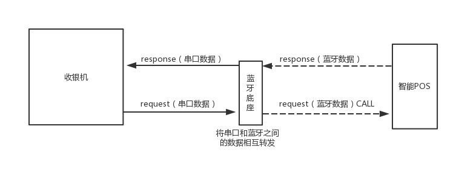

### 一、使用场景和流程

传统收银机需要连接讯联的智能 POS 进行收银，但是为了适应收银机上已有的一些业务系统，需要做到收银机唤起智能 POS，
同时接收来自收银机的一些参数，如金额，参考号等。待智能 POS 接收到请求并处理完毕之后，会立即将交易的处理结果返回给收银机。



需要下载风狐智能 POS 蓝牙版，才能具备串口唤起我们的应用功能，请扫描下方二维码，或 [下载到本地](http://ob7kiv99z.bkt.clouddn.com/2017-04-12_smartposcoco_v5.0.0_2017041214_externaldebug.apk)


注：目前只支持新大陆 N900 智能 POS + 新大陆 N900 蓝牙底座

### 二、传输数据格式定义

```json
//request 报文 (收银机 -> 智能 POS)
{
    "action":"CBANK",                                   //CBANK:银行卡消费, CQR:扫码消费, CANBANK:银行卡撤销, CANQR:扫码撤销, RETBANK:银行卡退货, RETQR:扫码退货, ORDER:订单查询
    "amount":"10.01",                                   //金额
    "extOrder":"1002016122912",                         //外部订单号（可选）
    "refNum":"361172435022",                            //原交易参考号
    "revAuthCode":"012345",                             //原交易授权码
    "batchNum":"000001",                                //原交易批次号
    "traceNum":"000012",                                //原交易凭证号
    "transDatetime":"1229",                             //原交易日期(MMdd)
    "page":"1",                                         //第几页（从1开始）
    "size":"10",                                        //每页返回的条数
    "txnType":"QR"                                      //账单类型 CARD:银行卡账单, QR:扫码账单, ALL:银行卡和扫码账单
}

//response 报文 (智能 POS -> 收银机)
{
    "status":1,                                         //状态 1 成功；0 失败；
    "msg":"success",                                    //详细信息
    "data":[                                            //数据
            {                                           //交易数据字段详情可见 javadoc
                "additionalResData": "0102000010134001",//附加响应数据
                "batchNum": "000001",                   //批次号
                "billingAmt": "",                       //持卡人扣帐金额
                "billingCurr": "",                      //持卡人扣帐货币代码
                "cardBrand": "CUP",                     //国际信用卡公司代码
                "cardNo": "6222042600001000",           //银行卡号(后续将会返回622204****1000形式)
                "clearingDate": "0122",                 //清算日期
                "localTransDate": "0122",               //受卡方所在地日期
                "localTransTime": "142139",             //受卡方所在地时间
                "merCode": "201605260000001",           //商户号
                "posInputStyle": "",                    //服务点输入方式码
                "processflag": "0",                     //交易处理标志
                "refNum": "022142445573",               //检索参考号
                "respCode": "00",                       //应答码
                "revAuthCode": "007508",                //授权标识应答码
                "revFlag": "0",                         //冲正标志
                "revInsCode": "0102000010134001",       //附加响应数据
                "scanCodeId": "",                       //扫码号
                "termCode": "00000007",                 //终端号
                "traceNum": "000037",                   //凭证号
                "transAmt": "10.01",                    //交易金额
                "transCode": "PER",                     //交易类型码
                "transCurr": "156",                     //交易货币代码
                "transDate": "20170122142141",          //原交易日期
                "transDatetime": "0122142139",          //受卡方所在地日期＋受卡方所在地时
                "transRate": "",                        //持卡人扣帐汇率
                "merDiscount":"1.00",                   //商家优惠金额
                "coupon":"0.01"                         //支付宝/微信优惠金额
            },
            ...
        ]
}
```

注意：respCode 应答码表可参见[交易应答码表V3](/user-guide/attachments/#v320160811)

### 三、调试方法

将蓝牙底座和串口正确连接，并且将智能 POS 机上的蓝牙底座应用打开，找到底座蓝牙并且连接成功。然后就可以使用串口调试工具发送示例报文了。


### 四、交易报文示例

* 银行卡消费

```json
//request
{
  "action": "CBANK",
  "amount": "10.01",
  "extOrder":"1002016122912"
}

//response
{
  "data": [
    {
      "additionalResData": "01020000   10134001   ",
      "batchNum": "000001",
      "billingAmt": "",
      "billingCurr": "",
      "cardBrand": "CUP",
      "cardNo": "6222042600001000",
      "clearingDate": "0122",
      "localTransDate": "0122",
      "localTransTime": "142139",
      "merCode": "201605260000001",
      "posInputStyle": "",
      "processflag": "0",
      "refNum": "022142445573",
      "respCode": "00",
      "revAuthCode": "007508",
      "revFlag": "0",
      "revInsCode": "01020000   10134001   ",
      "scanCodeId": "",
      "termCode": "00000007",
      "traceNum": "000037",
      "transAmt": "10.01",
      "transCode": "PER",
      "transCurr": "156",
      "transDate": "20170122142141",
      "transDatetime": "0122142139",
      "transRate": ""
    }
  ],
  "msg": "success",
  "status": 1
}
```

* 银行卡撤销

```json
//request
{
  "action": "CANBANK",
  "amount": "10.01",
  "traceNum": "000037",
  "extOrder":"1002016122912"
}

//response
{
  "data": [
    {
      "additionalResData": "01020000   10134001   ",
      "batchNum": "000001",
      "billingAmt": "",
      "billingCurr": "",
      "cardBrand": "CUP",
      "cardNo": "6222042600001000",
      "clearingDate": "0122",
      "localTransDate": "0122",
      "localTransTime": "145536",
      "merCode": "201605260000001",
      "posInputStyle": "",
      "processflag": "0",
      "refNum": "022142445573",
      "respCode": "00",
      "revAuthCode": "007508",
      "revFlag": "0",
      "revInsCode": "01020000   10134001   ",
      "scanCodeId": "",
      "termCode": "00000007",
      "traceNum": "000040",
      "transAmt": "10.01",
      "transCode": "PVR",
      "transCurr": "156",
      "transDate": "20170122145538",
      "transDatetime": "0122145536",
      "transRate": ""
    }
  ],
  "msg": "success",
  "status": 1
}
```

* 银行卡退货

```json
//request
{
  "action": "RETBANK",
  "amount": "10.01",
  "refNum": "022145445612",
  "transDatetime": "0122",
  "extOrder":"1002016122912"
}
//response
{
  "data": [
    {
      "additionalResData": "01020000   10134001   ",
      "batchNum": "000001",
      "billingAmt": "",
      "billingCurr": "",
      "cardBrand": "CUP",
      "cardNo": "6222042600001000",
      "clearingDate": "0122",
      "localTransDate": "0122",
      "localTransTime": "150037",
      "merCode": "201605260000001",
      "posInputStyle": "",
      "processflag": "0",
      "refNum": "022145445612",
      "respCode": "00",
      "revAuthCode": "",
      "revFlag": "0",
      "revInsCode": "01020000   10134001   ",
      "scanCodeId": "",
      "termCode": "00000007",
      "traceNum": "000042",
      "transAmt": "10.01",
      "transCode": "CTH",
      "transCurr": "156",
      "transDate": "20170122150039",
      "transDatetime": "0122150037",
      "transRate": ""
    }
  ],
  "msg": "success",
  "status": 1
}
```

* 扫码消费

```json
//request
{
  "action": "CQR",
  "amount": "0.01",
  "extOrder":"1002016122912"
}

//response
{
  "data": [
    {
      "additionalResData": "00000000   10134001   ",
      "batchNum": "000001",
      "billingAmt": "",
      "billingCurr": "",
      "cardBrand": "ALP",
      "cardNo": "pho***@foxmail.com",
      "clearingDate": "",
      "localTransDate": "0122",
      "localTransTime": "145144",
      "merCode": "201605260000001",
      "posInputStyle": "040",
      "processflag": "0",
      "refNum": "022145445609",
      "respCode": "00",
      "revAuthCode": "",
      "revFlag": "0",
      "revInsCode": "00000000   10134001   ",
      "revOrderNum": "2017012221001004480248605076",
      "scanCodeId": "E68890E58A9F",
      "termCode": "00000007",
      "traceNum": "000038",
      "transAmt": "0.01",
      "transCode": "BPA",
      "transCurr": "156",
      "transDate": "20170122145149",
      "transDatetime": "0122145144",
      "transRate": ""
    }
  ],
  "msg": "success",
  "status": 1
}
```

* 扫码撤销

```json
//request
{
  "action": "CANQR",
  "amount": "0.01",
  "traceNum": "000038",
  "extOrder":"1002016122912"
}

//response
{
  "data": [
    {
      "additionalResData": "00000000   10134001   ",
      "batchNum": "000001",
      "billingAmt": "",
      "billingCurr": "",
      "cardBrand": "ALP",
      "cardNo": "pho***@foxmail.com",
      "clearingDate": "",
      "localTransDate": "0122",
      "localTransTime": "145411",
      "merCode": "201605260000001",
      "posInputStyle": "",
      "processflag": "0",
      "refNum": "022145445610",
      "respCode": "00",
      "revAuthCode": "",
      "revFlag": "0",
      "revInsCode": "00000000   10134001   ",
      "revOrderNum": "2017012221001004480248605076",
      "scanCodeId": "E68890E58A9F",
      "termCode": "00000007",
      "traceNum": "000039",
      "transAmt": "0.01",
      "transCode": "BPA",
      "transCurr": "156",
      "transDate": "20170122145414",
      "transDatetime": "0122145411",
      "transRate": ""
    }
  ],
  "msg": "success",
  "status": 1
}
```

* 扫码退货

```json
//request
{
  "action": "RETQR",
  "amount": "0.01",
  "refNum": "022150445617",
  "transDatetime": "0122",
  "extOrder":"1002016122912"
}

//response
{
  "data": [
    {
      "additionalResData": "00000000   10134001   ",
      "batchNum": "000001",
      "billingAmt": "",
      "billingCurr": "",
      "cardBrand": "ALP",
      "cardNo": "pho***@foxmail.com",
      "clearingDate": "",
      "localTransDate": "0122",
      "localTransTime": "150601",
      "merCode": "201605260000001",
      "posInputStyle": "",
      "processflag": "0",
      "refNum": "022150445618",
      "respCode": "00",
      "revAuthCode": "",
      "revFlag": "0",
      "revInsCode": "00000000   10134001   ",
      "revOrderNum": "2017012221001004480248627853",
      "scanCodeId": "E68890E58A9F",
      "termCode": "00000007",
      "traceNum": "000044",
      "transAmt": "0.01",
      "transCode": "BPA",
      "transCurr": "156",
      "transDate": "20170122150605",
      "transDatetime": "0122150601",
      "transRate": ""
    }
  ],
  "msg": "success",
  "status": 1
}
```

* 交易明细

```json
//request
{
  "action": "ORDER",
  "page": "1",
  "size": "10",
  "txnType": "QR"
}

//response
{
  "data": [
    {
      "batchNum": "000001",
      "billingAmt": ".01",
      "billingCurr": "156",
      "cardBrand": "ALP",
      "cardNo": "0000000000000000000",
      "insCode": "10134001",
      "merCode": "201605260000001",
      "processflag": "0",
      "refNum": "022150445618",
      "respCode": "00",
      "revAuthCode": "      ",
      "revFlag": "0",
      "revOrderNum": "2017012221001004480248627853",
      "termCode": "00000007",
      "traceNum": "000044",
      "transAmt": "0.01",
      "transCode": "BTH",
      "transCurr": "156",
      "transDate": "20170122",
      "transDatetime": "0122150601",
      "transRate": "30001000"
    },
    ...
  ],
  "msg": "success",
  "status": 1
}
```

* 会员卡（佰馏卡）
```json
//request
{
  "action": "VC_MEMBER"
}
//response
{
  "extra":{
      "amount": "100000",//金额
      "balance": "10000",//余额
      "points": "100",//积分
      "cardNum": "0000000000000000000",//卡号
      "requestType": {},
      "response": {},/消费返回信息
      "vcRespAggrRes": {},//合计信息
      "vcRespInquiry": {},//余额查询信息
      "originTransNum": ""//原交易号
    },
  "msg": "success",
  "status": 1
}
```

### 五、错误码(TODO)

|代码|意义
|:--|:--|
|0|失败|
|1|成功|
|-1|请求为空|
|-11|金额格式不合法|
|-12|参数长度错误|
|-13|未知交易类型|
|-14|日期格式错误|
|-15|报文格式错误|
|-16|字段为空|
|-17|无权限|
|-2|设备被占用|

### 六、Q&A (TODO)

* 1、为什么智能 POS 在有些界面接收到蓝牙发去的报文没任何反应呢？

当 N900 处在刷卡，打印等情况时，设备会被占用，主要体现在刷卡界面，扫码界面等和打印凭条的时候，
所以当智能 POS 应用处于以下界面的时候，会不接收蓝牙发过来的交易请求：
(为不和用户直接操作 POS 冲突，建议当应用处于主界面的时候发送请求)

扫码界面、等待刷卡界面、密码键盘界面、电子签名界面、交易成功界面、交易失败界面、订单详情界面、
设置界面、会员卡所有的界面、撤销确认界面、扫码退货界面、余额查询界面、DCC转EDC界面、收取小费界面、
小费撤销界面、收取小费确认界面、撤销小费确认界面、结算详情界面、历史结算详情界面、记账结算界面、
记账明细界面、现金结算界面、现金历史结算界面


