### **一、激活环节**  
只需要在初次使用终端时操作一次，内容包括了激活、初始化、下载参数。  
* 序列图
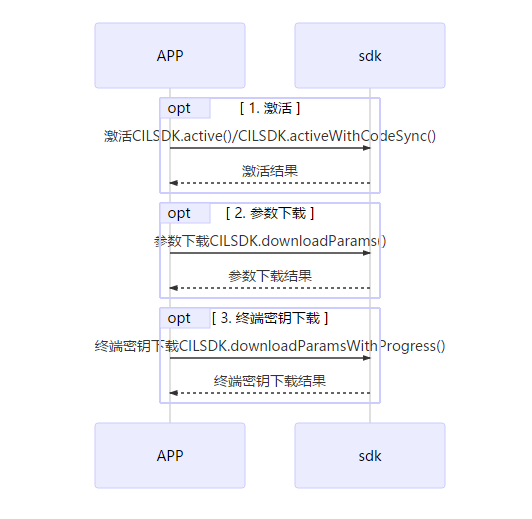

#### **激活**  
激活设备，有老版和新版两种激活方式

 
1. 新版激活接口(入参激活码)：  
CILSDK.activeWithCodeSync(activeCode, deviceToken, new Callback<CILResponse>());  

2. 老版激活接口：  
` CILSDK.active(merCode, termCode, new Callback<CILResponse>() `

| 参数        | 参数名称      | 样例 | 备注 |
| ------------- |-------------|  -----|---|
| merCode  | 商户代码     |  021290050110001 | 15位数字，激活时必填 |
| termCode | 终端代码     |  00000001 | 8位数字，激活时必填 |

` new Callback<CILResponse> ` 是回调函数  

#### **参数下载**  
参数下载在主要应用在以下两种情况：
1. 激活时下载参数 
2. 参数修改后下载参数

`  CILSDK.downloadParams(merCode, termCode, new com.cardinfolink.pos.listener.Callback<CILResponse>() `
其中，`new com.cardinfolink.pos.listener.Callback<CILResponse>() `是回调函数

#### **初始化**  
初始化主要是终端密钥下载，包含了主密钥下载和工作密钥下载。其主要应用在以下两种情况：
1.激活时初始化密钥 
2.需要更新密钥时初始化

` CILSDK.downloadParamsWithProgress(new ProgressCallback<CILResponse>()`

### **二、签到**  
签到其实就是一个更新密钥的过程，激活时已经覆盖了每日一次签到的操作。

`CILSDK.signIn(new Callback<CILResponse>()`

### **三、配置**

**可配置参数**  
1. 批次号、流水号
批次号用于结算，流水号（凭证号）定位本批每一笔交易唯一索引；

设置批次号  
`boolean isSuccess = CILSDK.setBatchNum(int batchNum);`  
获取批次号  
`int batchNum = CILSDK.getBatchNum();`  
设置流水号  
`boolean isSuccess = CILSDK.setSerialNum(int serialNum);`  
获取流水号  
`int serialNum = CILSDK.getSerialNum();`

### **四、打印**  
交易成功后，需要打印签购单，一般打印两联：商户联和客户联。商户联在持卡人签名后由商户保存。交易成功后，会自动打印商户联。
需要补打小票时，可以早交易明细中找到补打功能，打印商户联。

* 序列图  
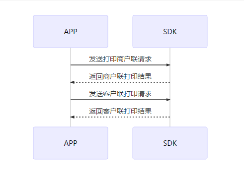  
 * 打印银行类／扫码交易小票  
`CILSDK.printKindsReceipts(trans,lineBreak,formatTransCode, kind, isForeignTrans,  bitmap, new Callback<PrinterResult>()`

| 参数        | 参数名称      |
| ------------- |---------------|
| trans  | 交易信息     |
| lineBreak | 小票结尾需要走纸换行的行数    |
|formatTransCode|小票的交易类型（String类型）|
|kind|小票的子标题，判断是商户联或者是客户联(int)|
|isForeignTrans|是否是外卡类交易|
|bitmap|logo图标|
| Callback|回调|

* 打印结算小票  
`CILSDK.printSettleReceipts(transSettles, transDatetime,batchNum, lineBreak, formatTransCode, new Callback<PrinterResult>()`

| 参数        | 参数名称      |
| ------------- |---------------|
| transSettles |  结算信息List    |
|transDatetime|结算时间|
|batchNum|批次号|
|lineBreak|打印结尾换行数|
|formatTransCode|结算类型|
| Callback|回调|

* 自定义打印  
`CILSDK.printBufferReceipt(buffer, lineBreak,new Callback<PrinterResult>()`

| 参数        | 参数名称      |
| ------------- |---------------|
| buffer |  打印内容   |
|linebreak|打印结尾换行数|
| Callback|回调|

* 打印二维码  
`CILSDK.printQRCode(qrCode,position,width,lineBreak,new Callback<PrinterResult>() `

| 参数        | 参数名称      |
| ------------- |---------------|
|qrCode|  二维码   |
|position|二维码位置|
|width|二维码大小|
|lineBreak|打印结尾换行数|
|Callback|回调|

* 打印条形码  
`CILSDK.printBarCode(String barCode, int position, int lineBreak, new Callback<PrinterResult>()`

| 参数        | 参数名称      |
| ------------- |---------------|
| barCode |  条形码数字   |
|position| 条形码位置|
|lineBreak|打印结尾换行数|
| Callback|回调|

* 打印图片  
`CILSDK.printImage(bitmap, lineBreak, offset, new Callback<PrinterResult>() `

| 参数        | 参数名称      |
| ------------- |---------------|
|bitmap |   图片Bitmap|
|lineBreak | 换行数|
| offset  |偏移量|
|callback | 回调|

#### **五、消费**  

**1. 消费（插卡、刷卡、挥卡、手机NFC ）**  
支持开发者调用接口实现商家银行卡收款需求。
主要类型包括刷卡、插卡、挥卡以及手机NFC支付。

* 序列图  
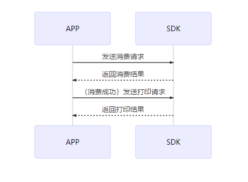  

1. APP界面输入消费金额，选择银行卡支付，发起银行卡付款请求
2. SDK处理交易，返回应答码
3. APP翻译应答码，输出结果
4. 如果消费成功，APP发送打印请求
5. SDK返回打印结果

**2. 消费【扫码】**  
支持开发者调用接口实现商家扫码收款需求。
主要类型包括微信扫码和支付宝扫码。

* 序列图 
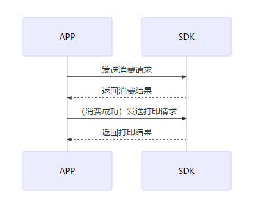  

1. APP界面输入消费金额，扫描二维码获取付款码信息，发起扫码付款请求
2. SDK处理消费请求，返回应答码
3. APP翻译应答码，输出结果
4. 如果消费成功，APP发送打印请求
5. SDK返回打印结果

#### **六、撤销**  
支持开发者调用接口实现商家撤销当日交易需求。
包括银行卡撤销和扫码撤销。

* 序列图  
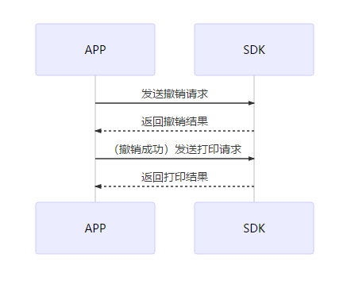  

1. APP界面输入原交易凭证号，核对该笔交易，发起撤销请求
2. SDK处理撤销请求，返回应答码
3. APP翻译应答码，输出结果
4. 撤销成功时，APP发送打印请求
5. SDK返回打印结果

#### **七、退货**  
支持开发者调用接口实现商家非当日交易的退货需求。
包括银行卡退货和扫码退货。

* 序列图  
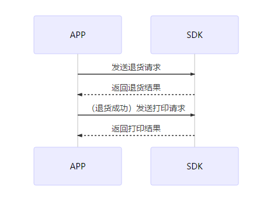  
 
1. APP界面输入订单相关信息（参考号／交易日期／退货金额），核对该笔交易，发起退货请求
2. SDK处理退货请求，返回应答码
3. APP翻译应答码，输出结果
4. 退货成功时，APP发送打印请求
5. SDK返回打印结果

#### **八、预授权类**  
支持开发者调用接口实现部分商家（如酒店、租车）的预授权类需求。
支持银行卡和微信支付宝付款码业务。  
**卡预授权类**  
**1. 卡预授权**  
支持开发者调用接口实现部分商家（如酒店、租车）的预授权需求。
*持卡人在宾馆、酒店或出租公司消费，消费与结算不在同一时间完成，特约单位通过POS预先向发卡机构索要授权的行为。*  
* 序列图   
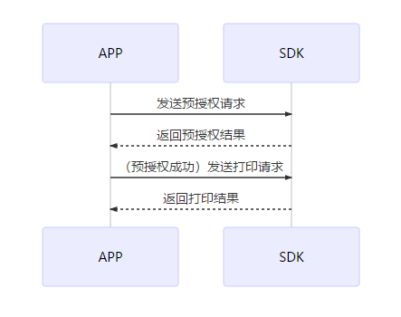  

1. APP界面输入消费金额，发起预授权请求
2. SDK处理预授权请求，返回应答码
3. APP翻译应答码，输出结果
4. 如果预授权成功，APP发送打印请求
5. SDK返回打印结果

**2. 卡预授权撤销**  
支持开发者调用接口实现部分商家（如酒店、租车）的预授权撤销需求。
*预授权撤销用来撤销之前的预授权交易，不限制当日。*

* 序列图
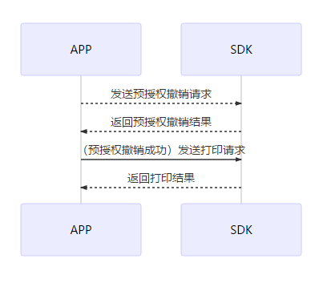  

1. APP界面：输入原预授权信息（金额\原交易日期\授权码），核对该笔交易，发起预授权撤销请求
2. SDK处理撤销请求，返回应答码
3. APP翻译应答码，输出结果页面
4. 预授权撤销成功时，APP发送打印请求
5. SDK返回打印结果

**3. 卡预授权完成**  
支持开发者调用接口实现部分商家（如酒店、租车）的预授权完成需求。
*预授权完成是持卡人消费完成并确定消费金额时，已取得预授权的特约商户在预授权金额或超出预授权金额一定比例的范围内，根据持卡人实际消费金额通过POS终端或手工方式完成持卡人付款的过程。*
* 序列图
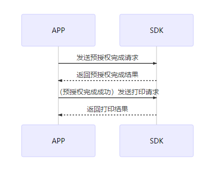  

1.  APP界面：输入预授权完成金额和原预授权信息（原交易日期\授权码），核对该笔交易，发起预授权完成请求
2. SDK处理预授权完成请求，返回应答码
3. APP翻译应答码，输出结果
4. 如果预授权完成成功，APP发送打印请求
5. SDK返回打印结果

**4. 卡预授权完成撤销**  
支持开发者调用接口实现部分商家（如酒店、租车）的预授权完成撤销需求。
*用来撤销已经成功的预授权完成交易。不限当日。要解冻相应的预授权交易金额，需要完成撤销预授权.*  

* 序列图  
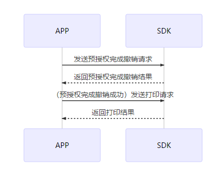   

1. APP界面：输入原凭证号，找到该笔预授权完成，发起预授权完成撤销请求
2. SDK处理预授权完成撤销请求，返回应答码
3. APP翻译应答码，输出结果
4. 预授权完成撤销成功时，APP发送打印请求
5. SDK返回打印结果  
6. 
**码预授权类**  
**1. 码预授权**  
支持开发者调用接口实现部分商家（如酒店、租车）的预授权需求。
*在宾馆、酒店或出租公司消费，消费与结算不在同一时间完成，特约单位通过POS预先向微信或支付宝冻结资金。*   

* 序列图 
 
  
1. APP界面输入消费金额，发起预授权请求
2. SDK处理预授权请求，返回应答码
3. APP翻译应答码，输出结果
4. 如果预授权成功，APP发送打印请求
5. SDK返回打印结果

**2. 码预授权撤销**  
支持开发者调用接口实现部分商家（如酒店、租车）的预授权撤销需求。
*预授权撤销用来撤销之前的预授权交易，不限制当日。*

* 序列图
  

1. APP界面：输入原预授权信息（金额\原交易日期\授权码），核对该笔交易，发起预授权撤销请求
2. SDK处理撤销请求，返回应答码
3. APP翻译应答码，输出结果页面
4. 预授权撤销成功时，APP发送打印请求
5. SDK返回打印结果

**3. 码预授权完成**  
支持开发者调用接口实现部分商家（如酒店、租车）的预授权完成需求。
*预授权完成是消费者消费完成并确定消费金额时，已取得预授权的特约商户在预授权金额或超出预授权金额一定比例的范围内，根据消费者实际消费金额通过POS终端或手工方式完成消费者付款的过程。*  

* 序列图
  

1.  APP界面：输入预授权完成金额和原预授权信息（原交易日期\授权码），核对该笔交易，发起预授权完成请求
2. SDK处理预授权完成请求，返回应答码
3. APP翻译应答码，输出结果
4. 如果预授权完成成功，APP发送打印请求
5. SDK返回打印结果  

**4. 码预授权完成撤销**   
支持开发者调用接口实现部分商家（如酒店、租车）的预授权完成撤销需求。
*用来撤销已经成功的预授权完成交易。不限当日。要解冻相应的预授权交易金额，需要完成撤销预授权.*  

* 序列图 
   

1. APP界面：输入原凭证号，找到该笔预授权完成，发起预授权完成撤销请求
2. SDK处理预授权完成撤销请求，返回应答码
3. APP翻译应答码，输出结果
4. 预授权完成撤销成功时，APP发送打印请求
5. SDK返回打印结果

#### **九、交易明细**  
支持开发者调用接口实现商家查看交易订单需求，同时可以补打、撤销订单。

* 序列图  
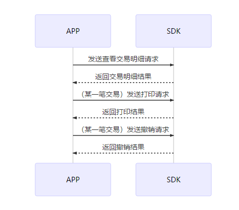  

1. APP界面：发起查看交易明细请求
2. SDK处理请求，返回应答码
3. APP翻译应答码，输出交易明细结果
4. 对某一笔订单，APP发送打印商户联请求
5. SDK返回打印商户联结果
6. 对某一笔订单，APP发送撤销请求
5. SDK返回撤销结果

**调用方法**  
`CILSDK.getBillsAsync(page, size, startTime, endTime, @BillType int type, callBackIsOnMainThread, new Callback<CILResponse>() `

| 参数        | 参数名称      |
| ------------- |---------------|
|  page | 从0开始|
|  size |每页返回的条数|
|  type |账单类型|
|  callback |回调|

#### **十、结算**  
支持开发者调用接口实现商家结算需求。
结算需求主要用于每日交易结束时或收银员交接班时，对某段时间内的账款核对。

* 序列图  
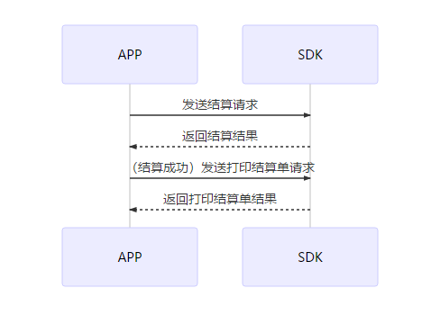  

1. APP界面：点击【去结算】，核对交易明细无误后【结算】，发起结算请求
2. SDK处理结算请求，返回应答码
3. APP翻译应答码，输出结果
4. 结算成功时，APP发送打印结算单请求
5. SDK返回打印结算单结果

**调用方法**  
` CILSDK.transSettleAsync(batchNum, new Callback<CILResponse>()`

| 参数        | 参数名称      |
| ------------- |---------------|
| batchNum |批次号|
| Callback|回调函数|

