**概要**

本文档详细介绍了用户APP、SDK与后台之间的交互作用，用图形直观简洁的介绍每个功能，并附有详细的文字说明加以解释。

**初始化**

* 激活
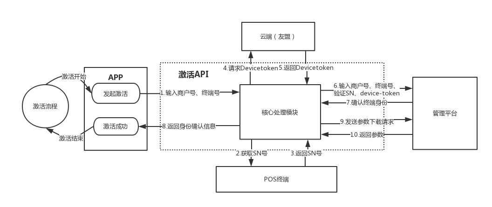
CIL分配商户号、终端号；sdk从终端获取sn号验证身份，从云端获取devicetoken，将上述信息上传到管理平台验证身份，身份合格后将参数下载到sdk内。

* 主密钥下载
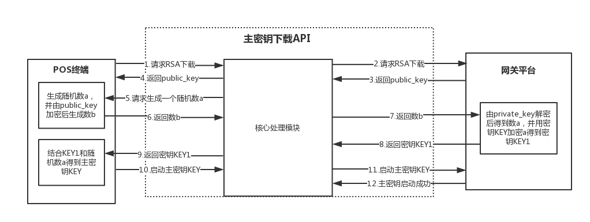
主密钥下载：采用非对称加密方式，获取主密钥KEY，并启动主密钥。

* 剩余工作密钥下载
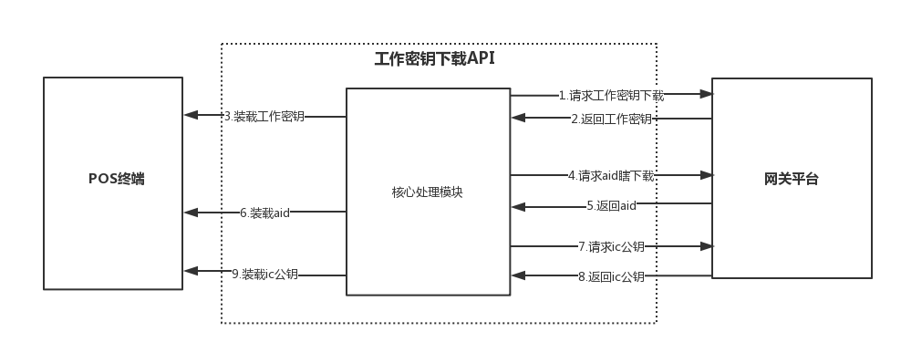
剩余工作密钥下载：下载工作密钥并装载；下载aid并装载；下载ic公钥并装载。

 

**消费**

* 银行卡消费
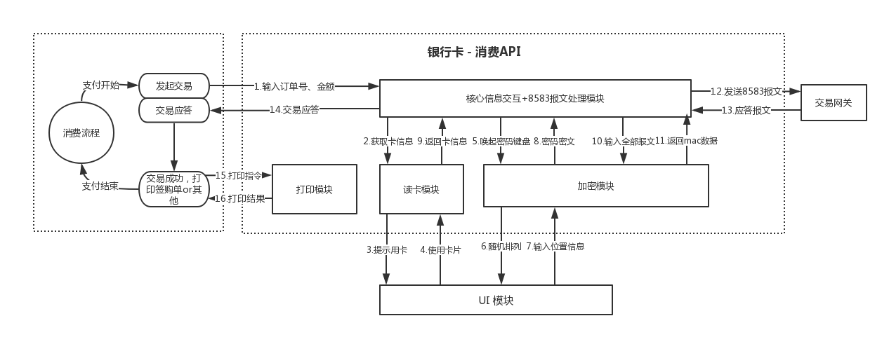
银行卡消费：输入金额，刷卡操作后，读卡模块获取卡片信息，加密模块获得密码密文，同卡片信息一起，全部报文经过加密模块加密后返回mac数据，经过8583报文处理模块处理后，发送给交易网关，网关返回应答报文。

* 扫码消费

扫码消费：输入金额后，扫描消费者付款码，加上终端信息，全部报文经加密模块加密后返回mac数据，经过8583报文处理模块处理后，发送给交易网关，网关返回应答报文。

 

**撤销**

* 银行卡撤销
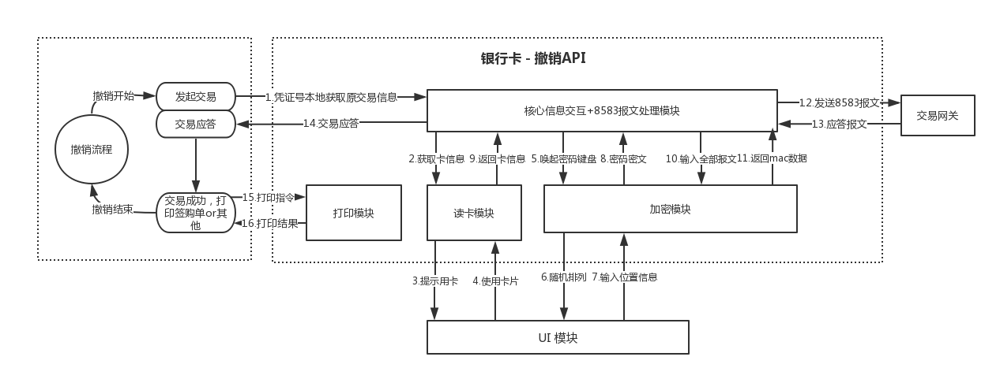
银行卡撤销：输入凭证号本地获取原交易信息，刷卡操作后，读卡模块获取卡片信息，加密模块获得密码密文，同卡片信息一起，全部报文经过加密模块加密后返回mac数据，经过8583报文处理模块处理后，发送给交易网关，网关返回应答报文。

* 扫码撤销

扫码撤销：输入凭证号本地获取原交易信息，全部报文经加密模块加密后返回mac数据，经过8583报文处理模块处理后，发送给交易网关，网关返回应答报文。

 

**退货**

* 银行卡退货

银行卡退货：输入金额、交易日期、参考号等获取原交易信息，刷卡操作后，读卡模块获取卡片信息，加密模块获得密码密文，同卡片信息一起，全部报文经过加密模块加密后返回mac数据，经过8583报文处理模块处理后，发送给交易网关，网关返回应答报文。

* 扫码退货

扫码撤销：输入金额、交易日期和参考号本地获取原交易信息，全部报文经加密模块加密后返回mac数据，经过8583报文处理模块处理后，发送给交易网关，网关返回应答报文。

 

**预授权类**

**卡预授权类**  

* 预授权
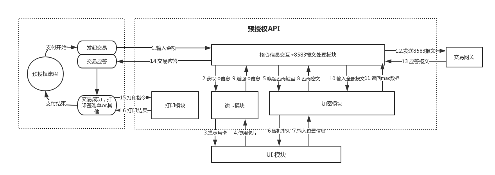
预授权：输入金额，刷卡操作后，读卡模块获取卡片信息，加密模块获得密码密文，同卡片信息一起，全部报文经过加密模块加密后返回mac数据，经过8583报文处理模块处理后，发送给交易网关，网关返回应答报文。

* 预授权撤销
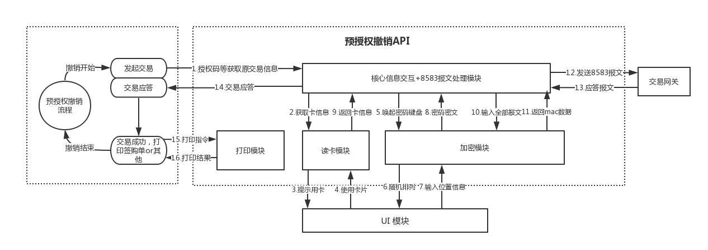
预授权撤销：输入相关信息获取原交易，刷卡操作后，读卡模块获取卡片信息，加密模块获得密码密文，同卡片信息一起，全部报文经过加密模块加密后返回mac数据，经过8583报文处理模块处理后，发送给交易网关，网关返回应答报文。

* 预授权完成
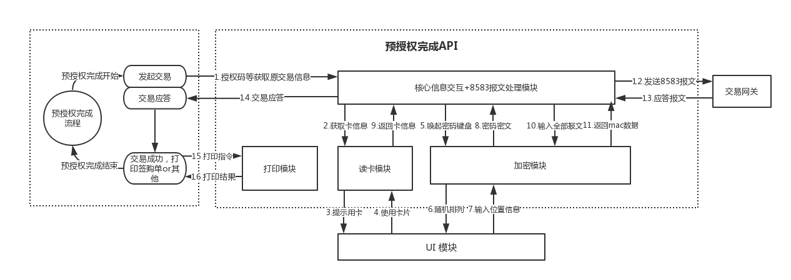
预授权完成：输入相关信息获取预授权交易，输入预授权完成金额后，刷卡操作，读卡模块获取卡片信息，加密模块获得密码密文，同卡片信息一起，全部报文经过加密模块加密后返回mac数据，经过8583报文处理模块处理后，发送给交易网关，网关返回应答报文。

* 预授权完成撤销
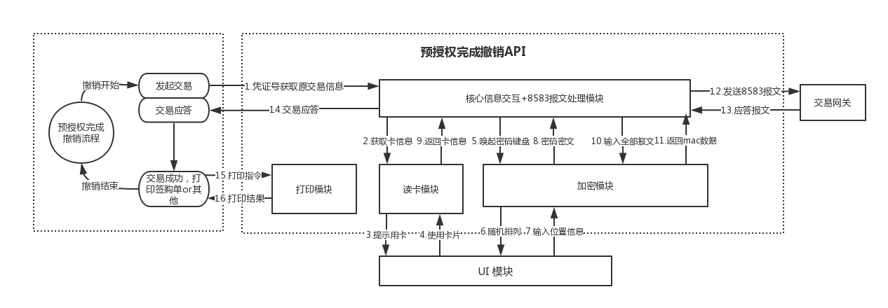
预授权完成撤销：输入相关信息获取预授权完成交易，刷卡操作后，读卡模块获取卡片信息，加密模块获得密码密文，同卡片信息一起，全部报文经过加密模块加密后返回mac数据，经过8583报文处理模块处理后，发送给交易网关，网关返回应答报文。

**码预授权类**
* 扫码预授权
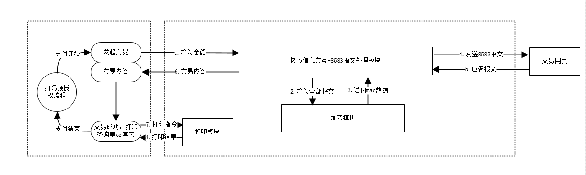
扫码预授权：输入金额后，扫描消费者付款码，全部报文经过加密模块加密后返回mac数据，经过8583报文处理模块处理后，发送给交易网关，网关返回应答报文。

* 扫码预授权撤销
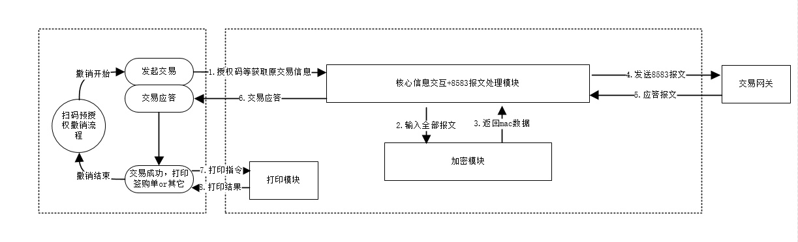
扫码预授权撤销：输入相关信息获取原交易，全部报文经过加密模块加密后返回mac数据，经过8583报文处理模块处理后，发送给交易网关，网关返回应答报文。

* 扫码预授权完成
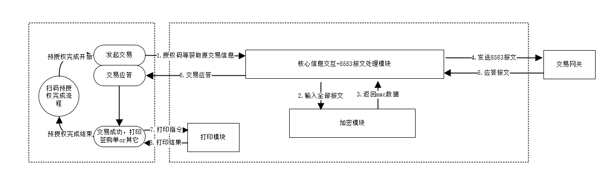
扫码预授权撤销：输入相关信息获取交易相关信息，全部报文经过加密模块加密后返回mac数据，经过8583报文处理模块处理后，发送给交易网关，网关返回应答报文。

* 扫码预授权完成撤销
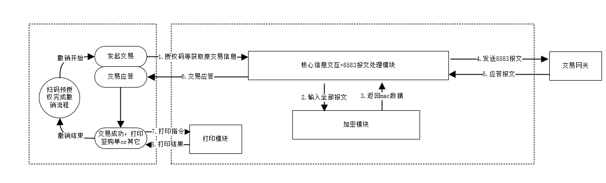
扫码预授权完成撤销：输入相关信息获取交易相关信息，全部报文经过加密模块加密后返回mac数据，经过8583报文处理模块处理后，发送给交易网关，网关返回应答报文。

 

**明细查询**

* 明细查询
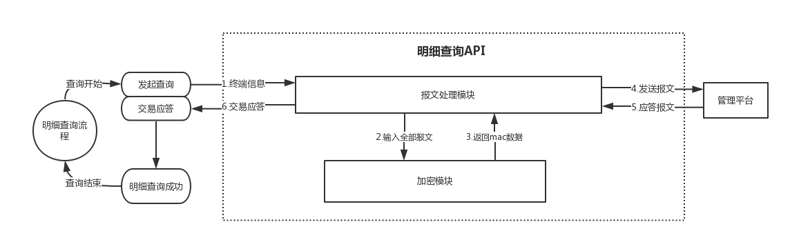
明细查询：发送终端信息到api，加密模块加密全部报文后返回mac数据，经过8583报文处理模块处理后，发送到管理平台，管理平台返回应答报文，终端显示。

 

**结算**

* 结算

结算：发送终端信息、商户号、结算批次号到api，加密模块加密全部报文后返回mac数据，经过8583报文处理模块处理后，发送到管理平台，管理平台返回应答报文，终端显示。

 

**小费**

* 收取小费

收取小费：app发起交易，将原交易信息、消费金额传送给api，加密模块加密全部报文后返回mac数据，经过8583报文处理模块处理后，发送到交易网关，交易网关返回应答报文，终端显示交易成功。

* 小费撤销
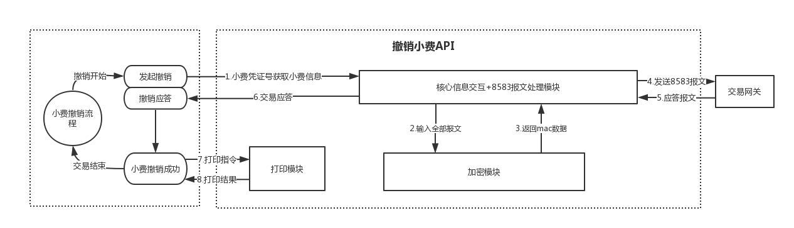
小费撤销：app发起交易，将原小费交易信息传送给api，加密模块加密全部报文后返回mac数据，经过8583报文处理模块处理后，发送到交易网关，交易网关返回应答报文，终端显示交易成功。

 

**余额查询**

* 余额查询

余额查询：app发起余额查询，刷卡后，读卡模块获取卡片信息，加密模块获得密码密文，同卡片信息一起，全部报文经过加密模块加密后返回mac数据，经过8583报文处理模块处理后，发送给交易网关，网关返回应答报文，app显示刷卡余额。
